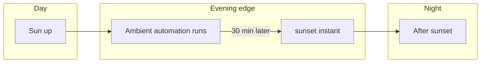
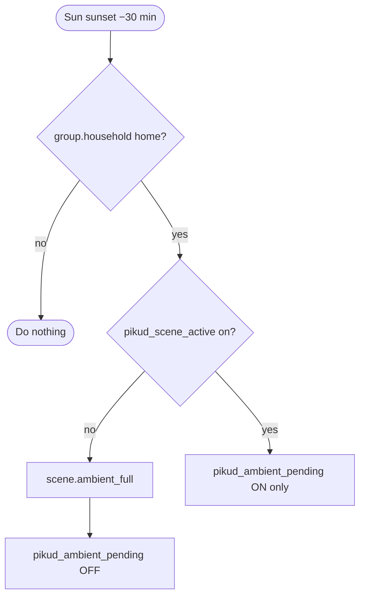
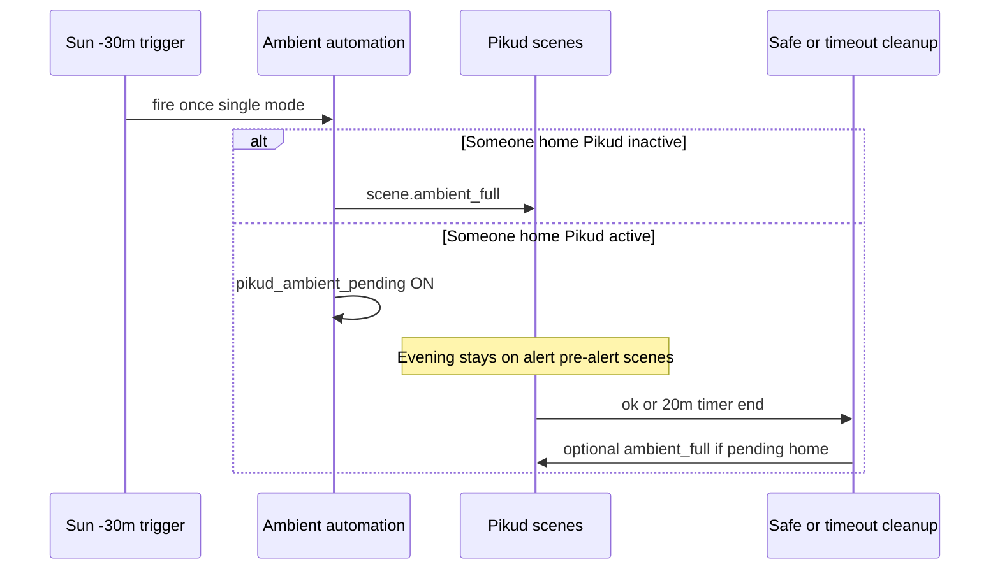

# Ambient lights at sunset

A single automation turns on **evening ambient** lighting when the sun is about to set and someone is **home**, while respecting an active **Pikud Oref** lighting session so the two automations do not overwrite each other at the wrong time.

**Related suite:** [automations-pikud-oref.md](automations-pikud-oref.md) explains `input_boolean.pikud_scene_active`, `input_boolean.pikud_ambient_pending`, and when `scene.ambient_full` is applied after pre-alert / alert clears.

## When sunset fires (clock picture)

Ambient is scheduled **30 minutes before** astronomical sunset (not at sunset itself):

```text
  day ─────────────────────────────── night
                              ^
                              |  sunset (astronomical)
                    ^         |
                    |         |
              automation    |
              runs here     |
         (−30 min offset)   |
```



---

## Automation (source: `automations.yaml`)

| Field | Value |
| ----- | ----- |
| `id` | `ambient_lights_sunset_household_home` |
| Alias | Ambient lights on if someone is home |
| Mode | single |

---

## Trigger

| Item | Detail |
| ---- | ------ |
| Platform | Sun |
| Event | `sunset` with offset **−30 minutes** (runs **30 minutes before** astronomical sunset). |

---

## Conditions

| Condition | Meaning |
| --------- | ------- |
| `group.household` state **home** | Ambient runs only when the household group considers someone present (same group Pikud uses for the deferred ambient branch). |

---

## Actions (branching)

The automation checks **`input_boolean.pikud_scene_active`**:

### Decision tree



| Branch | When | What happens |
| ------ | ---- | ------------ |
| Pikud **not** active | `pikud_scene_active` is **off** | Turn on `scene.ambient_full`, then turn **off** `input_boolean.pikud_ambient_pending` (clears any stale deferral). |
| Pikud **active** | `pikud_scene_active` is **on** | Turn **on** `input_boolean.pikud_ambient_pending` only (no `scene.ambient_full` yet). |

### Deferred ambient (sequence with Pikud)

**Later:** when Pikud moves to **safe** or the **20-minute pre-alert timer** finishes (see [Pikud Oref suite](automations-pikud-oref.md)), the corresponding automations turn on `scene.ambient_full` **if** `pikud_ambient_pending` is on **and** `group.household` is still **home**, then clear the pending flag.



---

## Shared entities (contract with Pikud)

| Entity | This automation | Pikud automations |
| ------ | --------------- | ----------------- |
| `scene.ambient_full` | Turns on when safe to do so | Same scene applied after safe/timeout when pending + home |
| `input_boolean.pikud_scene_active` | Read-only: choose branch | Set on pre-alert/alert; cleared on safe/timeout |
| `input_boolean.pikud_ambient_pending` | Set when deferring; cleared when applying ambient immediately | Read on safe/timeout; may turn on ambient and clear flag |
| `group.household` | Condition: must be home | Same group for deferred ambient application |

---

## Scenes and groups

- **`scene.ambient_full`** — Ambient LED / strip scene; defined in [`scenes.yaml`](../scenes.yaml).
- **`group.household`** — Household presence; defined in [`groups.yaml`](../groups.yaml).

---

## Operational tips

- If ambient never appears after sunset during Pikud events, confirm **`input_boolean.pikud_ambient_pending`** eventually clears and that **`group.household`** stays **home** when you expect deferred ambient.
- **Single** mode avoids duplicate runs for the same sunset trigger; unusual clock or HA restarts around sunset are handled by HA’s sun scheduler as usual.

---

## Index

- [Automation suite index](automations-index.md) — all documented automation groups.
