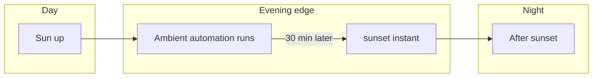
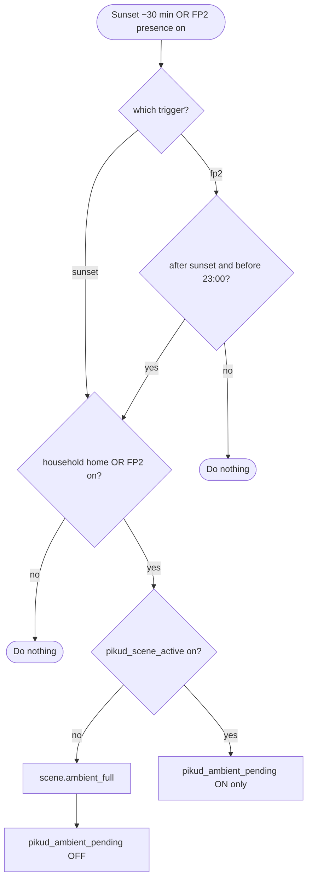
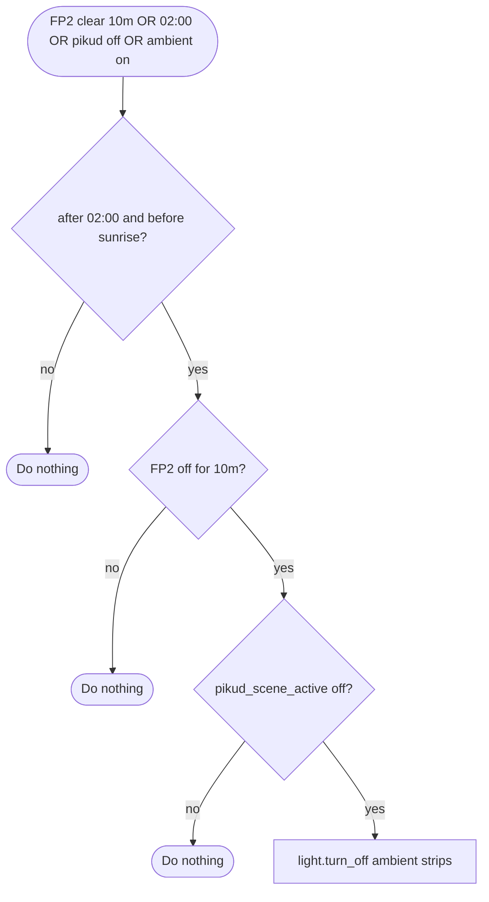
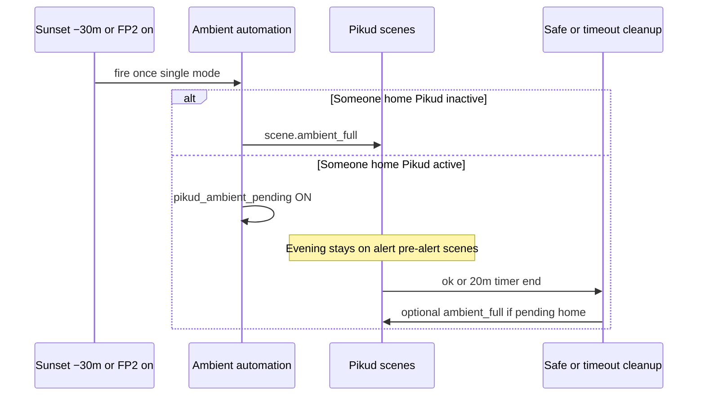

# Ambient lights at sunset

A suite of automations turns on **evening ambient** lighting when the sun is about to set (or later that evening) and someone is present — either **`group.household` home** or **FP2 zone 1 occupied** — and turns those lights **off after 02:00** when FP2 has been clear for **10 minutes**, while respecting an active **Pikud Oref** lighting session so the suites do not overwrite each other at the wrong time.

**Related suite:** [automations-pikud-oref.md](automations-pikud-oref.md) explains `input_boolean.pikud_scene_active`, `input_boolean.pikud_ambient_pending`, and when `scene.ambient_full` is applied after pre-alert / alert clears.

## When sunset fires (clock picture)

Ambient is scheduled **30 minutes before** astronomical sunset (not at sunset itself):

```text
  day ─────────────────────────────── night
                              ^
                              |  sunset (astronomical)
                    ^         |
                    |         |
              automation    |
              runs here     |
         (−30 min offset)   |
```



---

## Automations (source: `automations.yaml`)

| Field | On | Off |
| ----- | -- | --- |
| `id` | `ambient_lights_sunset_household_home` | `ambient_lights_off_fp2_clear_after_2am` |
| Alias | Ambient lights on if someone is home | Ambient lights off after 2am if FP2 clear |
| Mode | single | single |

---

## Triggers

Either trigger can start the automation (OR):

| Item | Detail |
| ---- | ------ |
| Sun (`id: sunset`) | Event `sunset` with offset **−30 minutes**. |
| Presence (`id: fp2`) | `binary_sensor.presence_sensor_fp2_dec1_presence_sensor_1` turns **on**. |



---

## Conditions

| Condition | Meaning |
| --------- | ------- |
| Presence OR | **`group.household`** is **home**, **or** **`binary_sensor.presence_sensor_fp2_dec1_presence_sensor_1`** is **on**. |
| Time path | **Sunset** trigger: always allowed (clock is already sunset −30). **FP2** trigger: only **after astronomical sunset** and **before 23:00**. |

---

## Actions (branching)

The automation checks **`input_boolean.pikud_scene_active`**:

### Decision tree

| Branch | When | What happens |
| ------ | ---- | ------------ |
| Pikud **not** active | `pikud_scene_active` is **off** | Turn on `scene.ambient_full`, then turn **off** `input_boolean.pikud_ambient_pending` (clears any stale deferral). |
| Pikud **active** | `pikud_scene_active` is **on** | Turn **on** `input_boolean.pikud_ambient_pending` only (no `scene.ambient_full` yet). |

---

## Turn off (after 2am, FP2 clear)

| Field | Detail |
| ----- | ------ |
| Triggers | FP2 turns **off** and stays clear for **10 minutes**; clock **02:00** (covers “already clear before 2am”); `pikud_scene_active` turns **off**; or any ambient strip turns **on** (covers post-safe / timeout applying `scene.ambient_full` when FP2 was already clear). |
| Conditions | After **02:00**, before **sunrise**, FP2 **off** for **10 minutes**, and `pikud_scene_active` **off**. |
| Action | `light.turn_off` on `light.stove_light`, `light.peninsula_light`, `light.curtain_light` (entities in `scene.ambient_full`). |



### Deferred ambient (sequence with Pikud)

**Later:** when Pikud moves to **safe** or the **20-minute pre-alert timer** finishes (see [Pikud Oref suite](automations-pikud-oref.md)), the corresponding automations turn on `scene.ambient_full` **if** `pikud_ambient_pending` is on **and** someone is still present (`group.household` **home** or FP2 zone 1 **on**), then clear the pending flag.



---

## Shared entities (contract with Pikud)

| Entity | This automation | Pikud automations |
| ------ | --------------- | ----------------- |
| `scene.ambient_full` | Turns on when safe to do so | Same scene applied after safe/timeout when pending + home |
| `input_boolean.pikud_scene_active` | Read-only: choose branch | Set on pre-alert/alert; cleared on safe/timeout |
| `input_boolean.pikud_ambient_pending` | Set when deferring; cleared when applying ambient immediately | Read on safe/timeout; may turn on ambient and clear flag |
| `group.household` | Presence condition (OR with FP2) | Same presence OR for deferred ambient |
| `binary_sensor.presence_sensor_fp2_dec1_presence_sensor_1` | Presence condition (OR), on-trigger, and clear→off | Same presence OR for deferred ambient |
| Ambient LED entities | Off automation turns them off | Also used in Pikud alert/safe scenes |

---

## Scenes and groups

- **`scene.ambient_full`** — Ambient LED / strip scene (`light.stove_light`, `light.peninsula_light`, `light.curtain_light`); defined in [`scenes.yaml`](../scenes.yaml).
- **`group.household`** — Household presence; defined in [`groups.yaml`](../groups.yaml).

---

## Operational tips

- If ambient never appears after sunset during Pikud events, confirm **`input_boolean.pikud_ambient_pending`** eventually clears and that **`group.household`** is **home** or FP2 zone 1 is **on** when you expect deferred ambient.
- **Single** mode avoids overlapping runs if sunset and FP2 fire close together; unusual clock or HA restarts around sunset are handled by HA’s sun scheduler as usual.
- Overnight off only keys off **FP2 clear** (not household away); lights stay if the zone stays occupied past 02:00.

---

## Index

- [Automation suite index](automations-index.md) — all documented automation groups.
