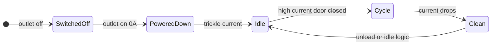

# Washing machine and dishwasher

Two parallel **Shelly power-monitoring** setups drive **`input_select.washing_machine_status`** and **`input_select.dishwasher_status`**, then **notify** when a cycle finishes and someone is home. Helpers to silence notifications are in [`input_boolean.yaml`](../input_boolean.yaml).

**Shared concept:** `group.household` **home** is used for “someone can empty the appliance” (same group as [ambient sunset](automations-ambient-sunset.md) and [Pikud deferred ambient](automations-pikud-oref.md)).

---

## Washing machine

| Automation `id` | Alias | Role |
| --------------- | ----- | ---- |
| `washingmachine_switchedoff` | Washing Machine - Change State Switched Off | Outlet **off** → Switched Off |
| `washingmachine_powereddown` | Washing Machine - Change State Powered Down | Outlet **on**, current **0** → Powered Down |
| `washingmachine_idle` | Washing Machine - Change State Idle | Small current band, outlet on, from off states or door-open escape from Clean |
| `washingmachine_wash` | Washing Machine - Change State Wash | High current, door closed, from allowed prior states |
| `washingmachine_clean` | Washing Machine - Change State Clean | Current drops after Wash |
| `washingmachine_notify_clean` | Washing Machine - Send alerts when clothes are clean | Telegram when Clean + home + time window + toggle off + rate limit |

**Hardware (YAML):** `switch.shellyplus1pm_b8d61a8a080c_washing_machine`, `sensor.shellyplus1pm_b8d61a8a080c_washing_machine_current`, washer door `binary_sensor.door_window_sensor_158d00044ab446`.

**Notify:** `input_boolean.disable_washing_machine_notification` must be **off**. Template rate-limits using the automation’s `last_triggered` (entity id in YAML follows slugified alias).

---

## Dishwasher

| Automation `id` | Alias | Role |
| --------------- | ----- | ---- |
| `dishwasher_switchedoff` | Dishwasher - Change State Switched Off | Outlet **off** → Switched Off |
| `dishwasher_powereddown` | Dishwasher - Change State Powered Down | Outlet **on**, current **0** → Powered Down |
| `dishwasher_idle` | Dishwasher - Change State Idle | Small current, from off states |
| `dishwasher_wash` | Dishwasher - Change State Wash | Current above threshold, door closed, mode **single** |
| `dishwasher_clean` | Dishwasher - Change State Clean | Current drops from Washing, mode **single** |
| `dishwasher_notify_clean_ntfy` | Dishwasher - Notify Clean via ntfy | ntfy when Clean + home + window + toggle + rate limit |

**Hardware (YAML):** `switch.shelly1pmg3_34b7dacb9110_dishwasher`, `sensor.shelly1pmg3_34b7dacb9110_dishwasher_current`, door `binary_sensor.door_window_sensor_158d000456ce96`.

**Notify:** `input_boolean.disable_dishwasher_notification` must be **off**. Publishes to `notify.pikudoref` (same notifier name as Pikud suite — different **topic**/routing is configured in HA, not in this repo).

---

## Typical state flow (both appliances)

---

## Cross-links

| Entity | Also used in |
| ------ | ------------ |
| `group.household` | [Ambient sunset](automations-ambient-sunset.md), [Pikud Oref](automations-pikud-oref.md) |

---

## Index

- [Automation suite index](automations-index.md)
