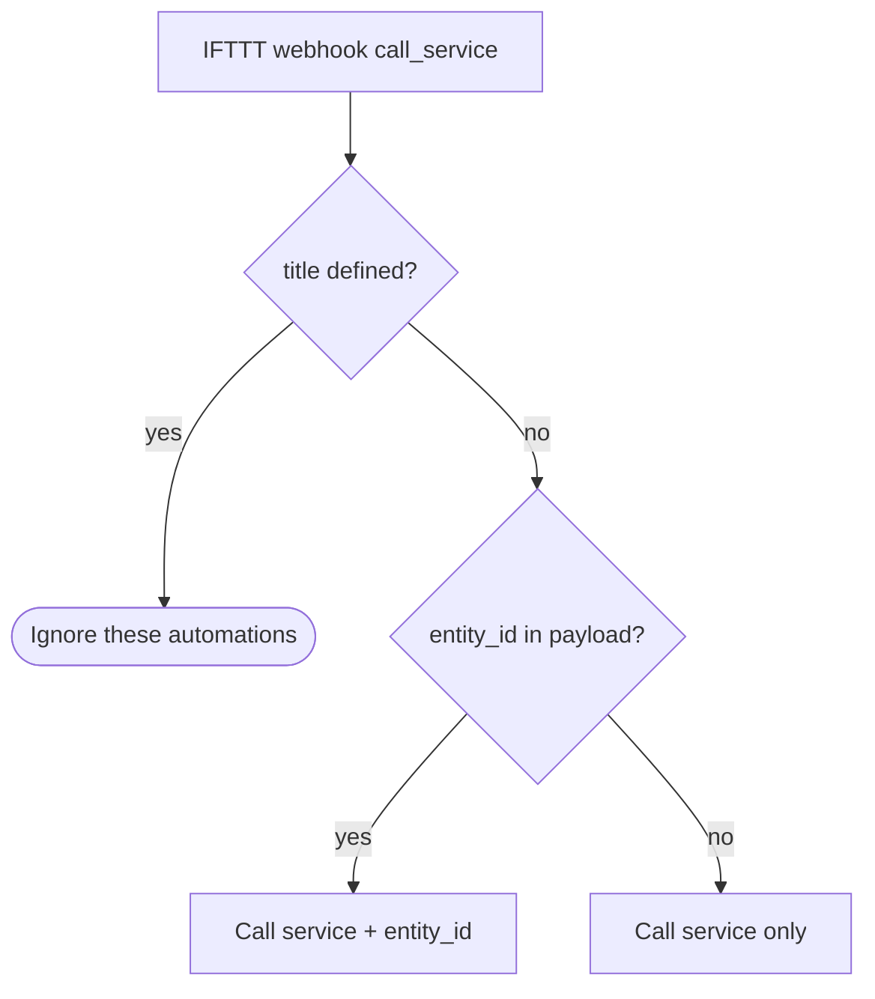

# Google helpers and IFTTT webhooks

**Google:** grocery list → Keep, arbitrary text → speaker TTS. **IFTTT:** generic `call_service` webhooks for toggling entities (including `input_boolean.living_ac`) and temperature-style calls, plus **startup** ping to IFTTT.

**Related:** [HVAC and living-room comfort](automations-hvac-living-comfort.md) for how `input_boolean.living_ac` ties to vibration and timer.

---

## Automations (source: `automations.yaml`)

| Automation `id` | Alias | Role |
| --------------- | ----- | ---- |
| `google_keep_add_from_input_text` | Google Keep - Add from text box | On `input_text.add_to_grocery_list` change → `google_keep.add_to_list` |
| `google_broadcast_from_input_text` | Google broadcast | On `input_text.google_broadcast` change → `tts.google_say` to `group.google_speakers` |
| `ifttt_toggle_living_ac_boolean` | Turn ON or OFF input_boolean.living_ac from IFTTT | `ifttt_webhook_received` + `action: call_service` with `entity_id` + `service` |
| `ifttt_report_indoor_temperature` | Report indoor temperature from IFTTT (Google Home) | Same webhook type but **without** `entity_id` in payload → forwards `service` only |
| `ha_startup_notification_ifttt` | Startup Notification | `homeassistant` **start** → `ifttt.trigger` event `HA event` |

---

## IFTTT webhook contract (conceptual)

Both IFTTT automations require `event_type: ifttt_webhook_received` and `event_data.action: call_service`.

**Toggle / entity call** (`ifttt_toggle_living_ac_boolean`):

- Conditions ensure `title` is **undefined** and `entity_id` is **defined**.
- Action: `service: '{{ trigger.event.data.service | lower }}'` with `entity_id` from payload (lowercased). Typical use: `homeassistant.turn_on` / `turn_off` on `input_boolean.living_ac`.

**Temperature-style** (`ifttt_report_indoor_temperature`):

- Conditions: no `title`, and **no** `entity_id` in payload.
- Action: `service` only from payload.

---

## Google Keep and broadcast

- **Keep:** Any state change on `input_text.add_to_grocery_list` fires `google_keep.add_to_list` with title `Grocery list` and `things` from state.
- **Broadcast:** Same pattern for `input_text.google_broadcast` → TTS on **`group.google_speakers`**.

---

## Startup → IFTTT

On HA **start**, triggers IFTTT event **`HA event`** with `value1: Home Assistant started` (for external monitoring or applets).

---

## Index

- [Automation suite index](automations-index.md)
