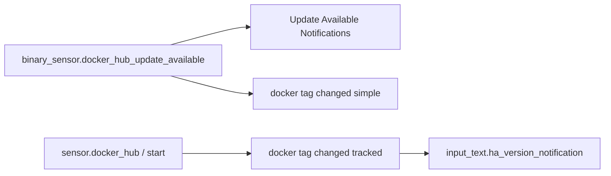

# Home Assistant platform notifications

Automations tied to **core / container updates**, **HACS**, **external DNS scripts**, **HTML5 action callbacks**, and **Healthchecks.io** heartbeat — not room-level comfort or appliances.

---

## Automations (source: `automations.yaml`)

| Automation `id` | Alias | Role |
| --------------- | ----- | ---- |
| `ha_update_available_html5` | Update Available Notifications | `binary_sensor.docker_hub_update_available` change → HTML5 “update available” |
| `ha_docker_tag_changed_simple` | Notify - Home Assistant docker tag changed (simple) | Same binary sensor, template filters trivial/unavailable flaps → persistent + HTML5 |
| `ha_docker_tag_changed_var` | Notify - Home Assistant docker tag changed (tracked) | `sensor.docker_hub` or HA **start**; compares `sensor.latest_docker_version` vs `input_text.ha_version_notification`; release-note links; updates stored version |
| `hacs_notify_new_repo` | Create a notification when something is added to HACS | `hacs/repository` registration event → persistent with repo link |
| `hacs_notify_updates` | Create a notification when there is updates pending in HACS | `sensor.hacs` non-zero → persistent listing repos |
| `duckdns_update_failed` | DuckDNS update script failed notification | `binary_sensor.duckdns_update_problem` **on** for **90 min** → Telegram |
| `html5_notification_clicked_update_fw` | Handle HTML5 notification action: Update FW | `html5_notification.clicked` + `action: update_shelly_fw` → `system_log.write` |
| `1673194670911` | Healthchecks HeartBeat | Every **10 minutes** (`time_pattern` minutes `/10`) → `shell_command.watchdog` |

---

## Update / Docker flow (simplified)

The **tracked** automation embeds links to [home-assistant.io latest release notes](https://www.home-assistant.io/latest-release-notes/) or GitHub release tags depending on version shape (see YAML).

---

## HACS

- **New repo:** Fires on `hacs/repository` with `action: registration` and valid `repository` in payload.
- **Pending updates:** Any state change on `sensor.hacs` where state is numeric and **not** zero → message lists `repositories` attributes.

---

## DuckDNS and HTML5

- **DuckDNS:** Long-running **on** state on `binary_sensor.duckdns_update_problem` before alerting (avoids brief blips).
- **HTML5 action:** Records a click for Shelly FW workflow auditing (no service call to update firmware in this automation).

---

## Healthchecks

Periodic **shell_command.watchdog** — typically pings a [Healthchecks.io](https://healthchecks.io/) URL defined in `configuration.yaml` / secrets (not duplicated here).

---

## Index

- [Automation suite index](automations-index.md)
