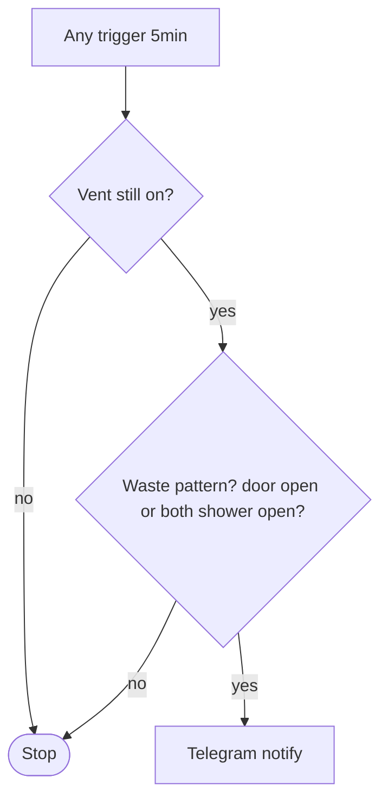
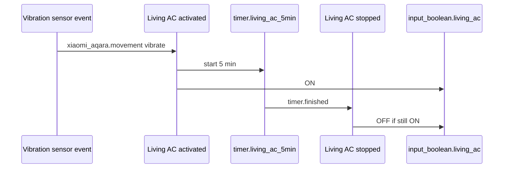

# HVAC and living-room comfort

Automations around **bedroom AC waste alerts**, **living-room AC presence proxy** (vibration + timer), and **IFTTT webhooks** that can drive the same living-room helper or report temperature.

**Shared helper:** `input_boolean.living_ac` is turned **on** by vibration and **off** when `timer.living_ac_5min` finishes, and can also be toggled by [IFTTT](automations-google-ifttt.md) (`ifttt_toggle_living_ac_boolean`). See [input_boolean.yaml](../input_boolean.yaml) for `living_ac`.

---

## Automations (source: `automations.yaml`)

| Automation `id` | Alias | Role |
| --------------- | ----- | ---- |
| `bedroom_ac_notify_on_openings` | Bedroom AC - Notify if doors or window open | Telegram if bedroom vent runs 5+ min with bad door/window combo |
| `living_ac_activated` | Living room AC - vibration detected | Start 5 min timer, set `input_boolean.living_ac` on |
| `living_ac_stopped` | Living room AC - stopped after timer | When timer ends, clear `input_boolean.living_ac` if still on |

IFTTT automations live in [automations-google-ifttt.md](automations-google-ifttt.md): `ifttt_toggle_living_ac_boolean`, `ifttt_report_indoor_temperature`.

---

## Bedroom AC — open envelope while cooling

**Triggers (any, 5 min sustained):** `binary_sensor.master_bedroom_ac_vent` on, or shower door/window on, or master bedroom door on.

**Conditions:** Vent must still be **on**, and the automation only fires when you are **wasting** energy: bedroom door **open**, **or** both shower door **and** shower window open (logic matches the Jinja message in YAML).

**Action:** `notify.send_message` → `notify.telegram_bot_1357375595_1168033187` with a title and a message that picks which openings to mention.

---

## Living-room AC — vibration proxy

Assumes a **Xiaomi / Aqara vibration** sensor on the AC unit reports `xiaomi_aqara.movement` with `movement_type: vibrate` for `binary_sensor.vibration_living_room_ac`.

1. **Activated** — On each qualifying event: `timer.start` → `timer.living_ac_5min`, `input_boolean.living_ac` **on**. Mode **single** (bursts coalesce per HA behavior).
2. **Stopped** — On `timer.finished` for that timer, if `living_ac` is still on → `input_boolean.turn_off`.

---

## Files and entities to touch when changing this suite

| Item | Location / note |
| ---- | --------------- |
| Automations | [`automations.yaml`](../automations.yaml) |
| `input_boolean.living_ac` | [`input_boolean.yaml`](../input_boolean.yaml) |
| Timer entity | Defined outside this snippet (UI or YAML) — `timer.living_ac_5min` |

---

## Index

- [Automation suite index](automations-index.md)
