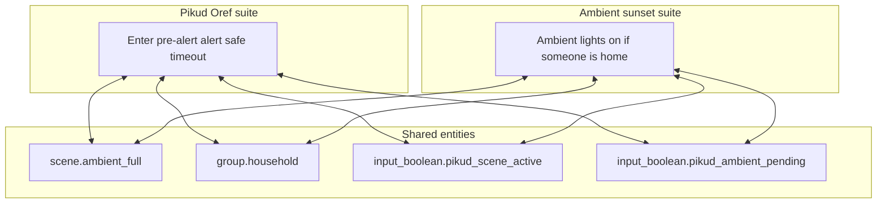

# Automation suite documentation

This folder groups **related automations** into readable guides. Each guide explains triggers, conditions, shared helpers, and how suites interact. The **authoritative definitions** are always in [`automations.yaml`](../automations.yaml) at the repository root.

## Documented suites

| Suite | Topic | Guide |
| ----- | ----- | ----- |
| Pikud Oref | Civil-defense alert lighting, snapshots, timer, notifications | [automations-pikud-oref.md](automations-pikud-oref.md) |
| Ambient at sunset | Evening ambient when someone is home | [automations-ambient-sunset.md](automations-ambient-sunset.md) |
| HVAC and living comfort | Bedroom AC waste alert, living AC vibration + timer, ties to IFTTT | [automations-hvac-living-comfort.md](automations-hvac-living-comfort.md) |
| Shower heater | Power bands → `input_select.shower_heater_status` | [automations-shower-heater.md](automations-shower-heater.md) |
| Appliances | Washing machine + dishwasher Shelly state machines + notify | [automations-appliances.md](automations-appliances.md) |
| Presence and devices | Boo’s home, unknown tracker, new `device_tracker` events | [automations-presence-and-devices.md](automations-presence-and-devices.md) |
| Google and IFTTT | Keep, broadcast TTS, IFTTT webhooks, startup trigger | [automations-google-ifttt.md](automations-google-ifttt.md) |
| HA platform | Docker/HACS/DuckDNS/HTML5 action, Healthchecks heartbeat | [automations-ha-platform.md](automations-ha-platform.md) |
| Monitoring and misc | Batteries, missing sensors, SpeedTest, blueprints, sports, No-IP | [automations-monitoring-alerts.md](automations-monitoring-alerts.md) |
| Main media | `input_select.main_media` ↔ scripts ↔ AVR/TV sync | [automations-main-media.md](automations-main-media.md) |

## Cross-links between suites

### Pikud Oref and ambient sunset

The **Pikud Oref** and **ambient sunset** suites share `scene.ambient_full`, `group.household`, and `input_boolean.pikud_ambient_pending`. If sunset happens during an active Pikud scene, ambient is **deferred** until Pikud clears.

### Other shared entities (quick map)

| Entity | Suites |
| ------ | ------ |
| `group.household` | [Ambient sunset](automations-ambient-sunset.md), [Pikud Oref](automations-pikud-oref.md), [Appliances](automations-appliances.md) |
| `input_boolean.living_ac` | [HVAC and living comfort](automations-hvac-living-comfort.md), [Google and IFTTT](automations-google-ifttt.md) |

## Related notes

- Broader troubleshooting and log findings: [HA_DIAGNOSTICS.md](HA_DIAGNOSTICS.md) (includes Pikud timing, battery template fix, and integration noise).

## Adding a new suite doc

When you add a new guide, extend the table in this file and link any automations that depend on helpers or scenes owned by another suite.
