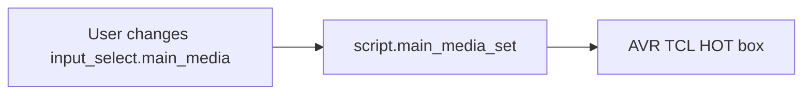
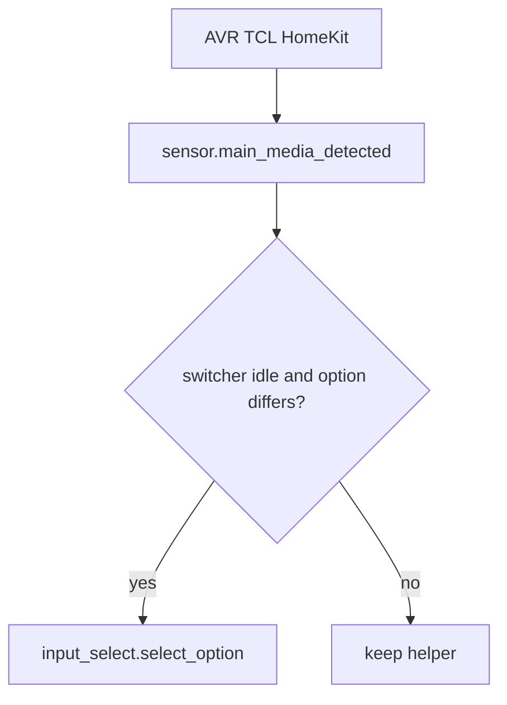

# Main media input select

Round trip: user (or UI / Google script) picks an activity → `script.main_media_set` switches AVR / TCL / HOT box; `sensor.main_media_detected` best-guesses from live devices → helper **syncs** without re-running the switcher.

AVR is **TV Audio** for every activity except **HOT** (MagicHD). TCL HDMI: **Cable** = HDMI 4, **Playstation** = HDMI 1 (HomeKit `media_player.85c855_television` when available).

---

## Automations (source: `automations.yaml`)

| Automation `id` | Alias | Mode | Role |
| --------------- | ----- | ---- | ---- |
| `1774986352971` | Main Media - Run script from helper | restart | User/UI helper change → `script.main_media_set` (ignores parent writes) |
| `1774988148886` | Main Media - Sync helper from devices | restart | Copy `sensor.main_media_detected` onto the helper |
| `main_media_ensure_options` | Main Media - Ensure helper options | single | HA start / automation reload → `input_select.set_options` |

---

## Run script from helper

**Trigger:** `input_select.main_media` any transition.

**Condition:** `from` and `to` exist and **differ**, `trigger.to_state.context.parent_id` is **none**, `input_boolean.main_media_sync_guard` is **off**, and transition is **not** streaming app → **HOT** (blocks sync-driven HOT relaunch when HomeKit Cable lingers).

**Action:** `script.main_media_set` with `media_activity: '{{ trigger.to_state.state }}'`.

---

## Detected sensor

`sensor.main_media_detected` (`templates/main_media.yaml`) is best-guess, **never Unknown**. First match wins; otherwise keep last state.

1. AVR off and TCL off → Off
2. TCL `app_id` / `app_name` contains jellyfin / plex / netflix / youtube / stremio / chromecast
3. HomeKit source Playstation / PS5 → Playstation
4. AVR source HOT, or HomeKit Cable **when AVR is not TV Audio** → HOT
5. Else previous value

Do **not** use `media_player.tcl_tv_2` (Jellyfin client session, not a second TV).

---

## Sync helper from devices

**Triggers:** `sensor.main_media_detected` changes, or `script.main_media_set` goes `off`.

**Conditions:** switcher is idle; detected value is a helper option; value differs from the helper.

**Action:** turn on sync guard → `input_select.select_option` → turn off guard.

---

## Scripts (`scripts.yaml`)

`script.main_media_set` is the switcher (`mode: restart`). Wrappers (`script.main_media_hot`, `_plex`, `_jellyfin`, `_stremio`, `_netflix`, `_youtube`, `_chromecast`, `_playstation`, `_off`) call it for Google Assistant.

### YouTube Michelle (standalone)

`script.main_media_youtube_michelle` — **not** routed through `main_media_set`. Turns on Marantz + TCL, AVR **TV Audio** at volume **35** (`volume_level: 0.35`), sends **HOME**, launches YouTube via `https://www.youtube.com`, then DPAD profile selection for **Michelle** (YouTube Kids profile).

| Step | Action |
| ---- | ------ |
| Power | Marantz + TCL on; HOT box off |
| AVR | Source TV Audio; `volume_set` 0.35 |
| App | `remote.turn_on` activity `https://www.youtube.com` |
| Profile | Best-effort DPAD on **Who's Watching** (`profile_dpad_right`, default **1** = second tile) + ENTER |

**Limitations:** No official deep link for a named YouTube profile. If the picker does not appear (YouTube resumes last profile), open the account menu manually once or increase the post-launch delay. Tune `profile_dpad_right` (0–6) to match Michelle's tile position. Google Assistant: **Script YouTube Michelle** (aliases include *YouTube Kids Michelle*). GA config change needs HA restart to sync.

| Activity | Marantz | TCL | Extra |
| -------- | ------- | --- | ----- |
| HOT | source HOT | HomeKit **Cable** if up; else `com.tcl.tv` | `living_room_hot` on; AVR volume **50%** (`volume_level: 0.5`) after HOT source |
| Plex / Jellyfin / Stremio / Netflix | TV Audio | Per-app launch (see below) | HOT box off (sequential, twice) |
| YouTube | TV Audio | URL only | HOT box off |
| Chromecast | TV Audio | TV on | HOT box off |
| Playstation | TV Audio | HomeKit **Playstation** if up; else input menu remote (`F3` → HDMI 1) | WoL `78:C8:81:F5:03:6A`; HOT box off |
| Off | turn_off | turn_off TCL | HOT box off; PS5 left in rest |

HomeKit HDMI select is skipped when `85c855_television` is unavailable (`continue_on_error`). **TCL HomeKit re-paired 2026-08-15** — live entity is `media_player.85c855_television` (port **35483**). Entity registry `_2` suffix removed 2026-08-15. SmartIR Broadlink controller: `remote.rmproplus_42_d7_58` (not raw IP).

### Android TV app launch (2026-08-15 evening, DPAD calibration)

Per-app branches in `script.main_media_set` — **no search/text fallback** (removed katniss `SEARCH`, `text:`, `market://`, and cross-app URL retries). TCL Google TV uses **voice search** in katniss; `androidtv_remote` `text:` does not reliably override stale voice queries (e.g. prior **“funny shows”** session — not in repo YAML).

| Activity | Steps (after power + AVR TV Audio + HOME + 800ms) |
| -------- | ---------------------------------------------- |
| YouTube | `play_media` URL `https://www.youtube.com` only |
| Netflix | `play_media` URL `https://www.netflix.com/title` only |
| Plex / Jellyfin / Stremio | `play_media` app package → wait 2s → **one** home-grid DPAD fallback if `app_id` still wrong |

**DPAD fallback (package apps only):** `HOME` → 75ms → `DPAD_DOWN` × `app_dpad_down` (75ms between each) → `DPAD_RIGHT` × `app_dpad_right` (75ms between each) → 75ms → `ENTER`. Runs only when package `play_media` fails after the initial `HOME` + 800ms. Navigates from **Google TV Home grid** (no `ALL_APPS` drawer). Wrapper defaults: `script.main_media_plex` down **2**, right **1**; `script.main_media_jellyfin` down **2**, right **2**; `script.main_media_stremio` down **2**, right **3**.

**HOME in fallback:** One `HOME` before DPAD (not two). Initial script `HOME` exits the foreground app; the fallback `HOME` resets Google TV grid focus when already on the launcher. MCP tests (2026-08-15 ~19:00): zero fallback `HOME` → wrong app or launcher; one fallback `HOME` → Plex reliably; second fallback `HOME` redundant. No native “reset focus” command in `androidtv_remote` (only `HOME`; `MOVE_HOME` not documented and untested as alternative).

**DPAD timing:** TCL Google TV currently uses **75ms** between each remote press. **100ms** and **200ms** also passed Stremio MCP tests; **75ms** passed 2/2 (2026-08-15).

**“Funny shows” root cause:** stale Google TV (katniss) voice search from a prior session. Opening `SEARCH` re-ran the old query; `text:Jellyfin` did not replace voice input. **Fix:** DPAD navigation from Home grid only.

**HOT box re-trigger (sensor fix):** `sensor.main_media_detected` no longer maps HomeKit **Cable** → HOT when AVR source is **TV Audio** (stale HDMI input during streaming). Sync guard + streaming→HOT block in run-script automation unchanged.

**MCP probes (TCL Google TV, 2026-08-15):**

| Method | Jellyfin | Netflix | YouTube |
| ------ | -------- | ------- | ------- |
| `play_media` app package | Silent fail (`app_id` stays launcher) | — | — |
| `play_media` URL | N/A | **Works** | **Works** |
| Home grid DPAD | `HOME`×2 reset + navigate from HOME; defaults per wrapper | — | — |

**HOT box:** `media_player.turn_off` on `living_room_hot` works via MCP. Streaming branch runs it sequentially after TV/AVR power-on and again after AVR source select.

---

## Index

- [Automation suite index](automations-index.md)
