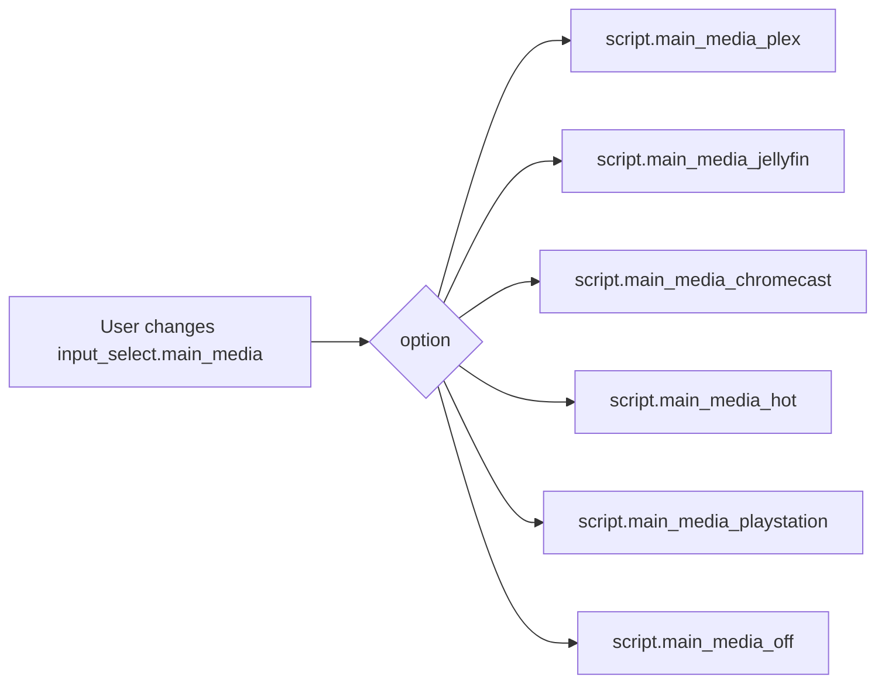
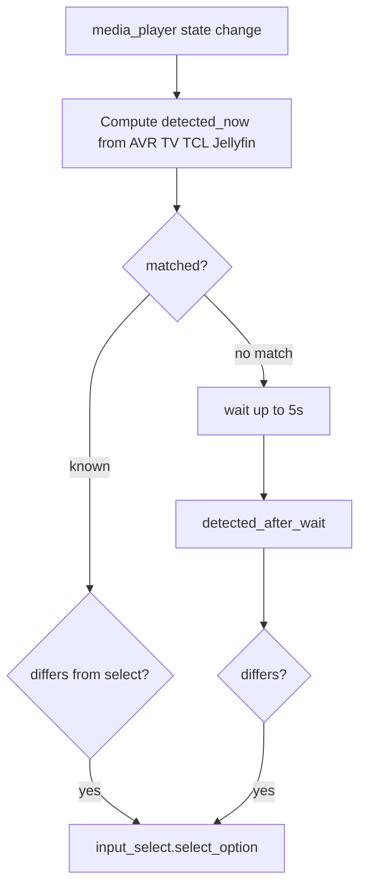

# Main media input select

Two automations form a **round trip**: user (or UI) picks a **source** on `input_select.main_media` → **scripts** run; physical **AVR / TV / app** state changes → select **syncs** back from `media_player` entities.

---

## Automations (source: `automations.yaml`)

| Automation `id` | Alias | Mode | Role |
| --------------- | ----- | ---- | ---- |
| `1774986352971` | Main Media - Run script from helper | single | On `input_select.main_media` change → `choose` matching **script** |
| `1774988148886` | Main Media - Sync helper from devices | restart | On Marantz / TV media_player **state** change → infer select |

---

## Run script from helper

**Trigger:** `input_select.main_media` any transition.

**Condition:** `from_state` and `to_state` exist and **differ** (ignores no-op updates).

**Actions:** `choose` branches for **Plex**, **Jellyfin**, **Chromecast**, **HOT**, **Playstation**, **Off** → `script.main_media_*`.

---

## Sync helper from devices

**Triggers:** State changes on:

- `media_player.marantz_nr1608`
- `media_player.85c855_television`
- `media_player.tcl_tv`
- `media_player.tcl_tv_2`

**Logic (high level):** Large Jinja template `detected_now` reads AVR source, TV source, TCL `app_name` / `app_id` / `media_title` / `source`, and Jellyfin player state. It maps combinations to **Off**, **HOT**, **Jellyfin**, **Plex**, **Chromecast**, **Playstation**, or **`__NO_MATCH__`**.

- If match is not `__NO_MATCH__` and differs from current select → update select.
- **Default:** wait up to **5 s** for sources to settle, recompute `detected_after_wait` (falls back to **Unknown** in template), then update if different.

**Mode restart** — rapid device flapping re-runs the automation from the latest trigger.

---

## Scripts

Scripts are referenced by name in YAML (`script.main_media_*`). Definitions live under your usual scripts package (e.g. `scripts.yaml` or includes) — not in `automations.yaml`.

---

## Index

- [Automation suite index](automations-index.md)
