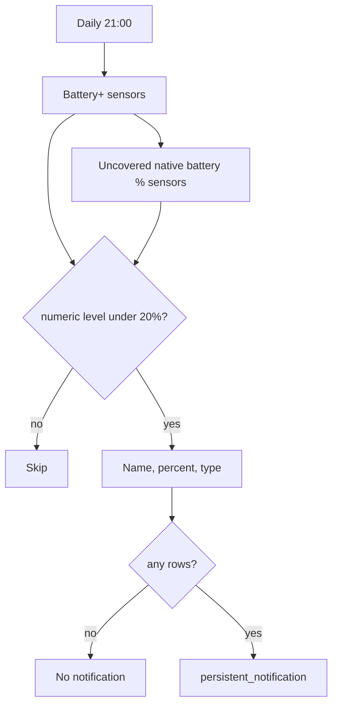

# Monitoring, batteries, and misc alerts

Daily **low-battery summary**, **sensor health** toggle, **SpeedTest** record-keeping, and a few **one-off** notifiers (sports, No-IP).

**Related:** Battery notification cleanup (duplicates, titles, device names) is noted in [HA_DIAGNOSTICS.md](HA_DIAGNOSTICS.md).

---

## Automations (source: `automations.yaml`)

| Automation `id` | Alias | Role |
| --------------- | ----- | ---- |
| `low_battery_check_all_sensors` | Low battery level detection & notification for all battery sensors | Daily 21:00 → one persistent notification of devices under **20%** (name, %, battery type) |
| `notify_missing_sensors` | Notify Missing Sensors | `input_boolean.notify_missing_sensors` **on** → sensors **unavailable** more than **14 days** |
| `track_speedtest_maximum_download` | Track SpeedTest Maximum Download | Hourly check; if `sensor.speedtest_download` beats `input_number.max_download_speed`, update it |
| `notify_maccabi_scores` | Notify when Maccabi scores | `sensor.tt_maccabi_fc` **team_score** attribute increases → persistent notification |
| `maccabi_tlv_goal_lights` | Maccabi TLV goal lights (FotMob) | `sensor.fotmob_maccabi_goals` increases while `binary_sensor.fotmob_maccabi_match_live` is **on** → flash curtain/peninsula/stove, then restore |
| `notify_noip_hosts_renewed` | notify PB if noip hosts were renewed | `sensor.noip_hosts_renewed` above 0 for 30s → Pushbullet |

---

## Daily battery check

- Runs **once a day at 21:00**.
- Prefers Battery Notes `*_battery_plus` sensors (one row per device). Falls back to other `device_class: battery` percentage sensors only when that device is not already listed.
- Uses a **canonical device name** (stripped friendly name / `name_by_user`), **level**, and **battery type** (for example CR2032).
- Skips `[BROKEN]` names, the `broken` label, binary “battery low” sensors, unknown/unavailable states, and hex-id duplicates.
- If the current Battery+ state is unknown but `battery_last_reported_level` is under 20%, that last value is used and marked `(last reported)`.
- **No notification** when nothing is below 20% (no “Low Battery Alert” for an all-OK house). Same `notification_id` replaces the previous card instead of stacking.

Example line: `- Master bedroom H&T — 1% (last reported) — CR2032`

---

## Missing sensors

Manual run: flip **`input_boolean.notify_missing_sensors`** to **on** (see [`input_boolean.yaml`](../input_boolean.yaml)). Automation builds a list of sensors unavailable for more than **two weeks** (by `last_updated`).

---

## SpeedTest maximum

Hourly: if current download **exceeds** stored `input_number.max_download_speed`, copy the new value in (PR-style “personal best” tracking).

---

## Misc notifiers

- **Maccabi (Team Tracker):** Attribute trigger on `sensor.tt_maccabi_fc`; compares int team score before/after → persistent notification.
- **Maccabi TLV goal lights (FotMob):** REST poll of FotMob daily matches (~30s) for team id **7855**. Entities from [`rest.yaml`](../rest.yaml): `sensor.fotmob_maccabi_goals` (always numeric; **0** when no match — no `availability_template` under `rest:`), `binary_sensor.fotmob_maccabi_match_live`. On goal increase while live, `scene.create` → Yeelight **Alarm** on curtain/peninsula/stove → 8s → `scene.turn_on` restore. Placeholder `scene.maccabi_goal_lights_snapshot` in [`scenes.yaml`](../scenes.yaml) keeps the editor happy; runtime create overwrites it. Verify: Developer tools → States for those entities on a match day; force a state change only for dry-run testing.
- **No-IP:** Docker renew counter sensor; Pushbullet when renews detected.

---

## Index

- [Automation suite index](automations-index.md)
