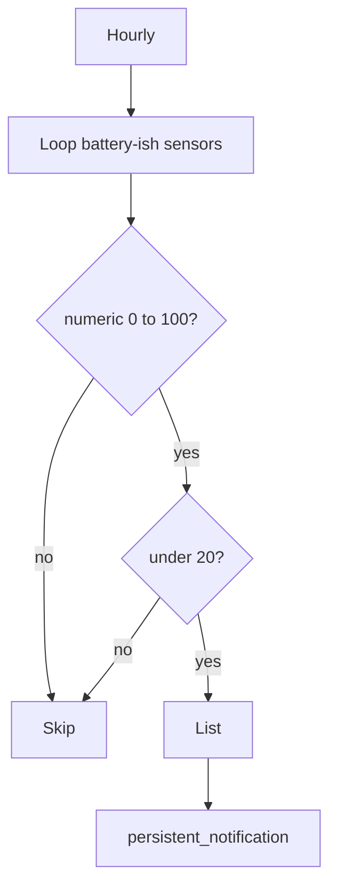

# Monitoring, batteries, and misc alerts

Hourly **battery sweep**, **blueprint-based** low-battery flows, **sensor health** toggle, **SpeedTest** record-keeping, and a few **one-off** notifiers (sports, No-IP).

**Related:** Template fix for non-numeric battery sensors is noted in [HA_DIAGNOSTICS.md](HA_DIAGNOSTICS.md) (low battery automation).

---

## Automations (source: `automations.yaml`)

| Automation `id` | Alias | Role |
| --------------- | ----- | ---- |
| `low_battery_check_all_sensors` | Low battery level detection & notification for all battery sensors | Hourly `time_pattern` → persistent notification listing sensors under **20%** (numeric 0–100 only) |
| `notify_missing_sensors` | Notify Missing Sensors | `input_boolean.notify_missing_sensors` **on** → sensors **unavailable** more than **14 days** |
| `track_speedtest_maximum_download` | Track SpeedTest Maximum Download | Hourly check; if `sensor.speedtest_download` beats `input_number.max_download_speed`, update it |
| `low_battery_notifications_actions1` | Low Battery Notifications & Actions (blueprint 1) | Blackshome blueprint, 21:00, level 10 |
| `low_battery_notifications_actions2` | Low Battery Notifications & Actions (blueprint 2) | Same blueprint + sticky notify data |
| `notify_on_low_batteries_blueprint` | Notify on low batteries | Same blueprint family, sticky |
| `notify_maccabi_scores` | Notify when Maccabi scores | `sensor.tt_maccabi_fc` **team_score** attribute increases → persistent notification |
| `notify_noip_hosts_renewed` | notify PB if noip hosts were renewed | `sensor.noip_hosts_renewed` above 0 for 30s → Pushbullet |

---

## Hourly battery check (custom Jinja)

- Runs **every hour**.
- Iterates `states.sensor`, filters entity id containing `battery`, skips unknown/unavailable, requires **`is_number`**, only **0–100** and **&lt; 20** count as low.
- Single persistent notification: either a bullet list or “all acceptable”.

---

## Missing sensors

Manual run: flip **`input_boolean.notify_missing_sensors`** to **on** (see [`input_boolean.yaml`](../input_boolean.yaml)). Automation builds a list of sensors unavailable for more than **two weeks** (by `last_updated`).

---

## SpeedTest maximum

Hourly: if current download **exceeds** stored `input_number.max_download_speed`, copy the new value in (PR-style “personal best” tracking).

---

## Blueprint battery automations

Three automations use **`use_blueprint`** → `Blackshome/low-battery-notifications-and-actions.yaml` with **21:00** and **10%** threshold (see YAML for `include_*` and `notify_data` differences). They complement — and differ from — the hourly **all-battery** summary.

---

## Misc notifiers

- **Maccabi:** Attribute trigger on live score sensor; compares int team score before/after.
- **No-IP:** Docker renew counter sensor; Pushbullet when renews detected.

---

## Index

- [Automation suite index](automations-index.md)
