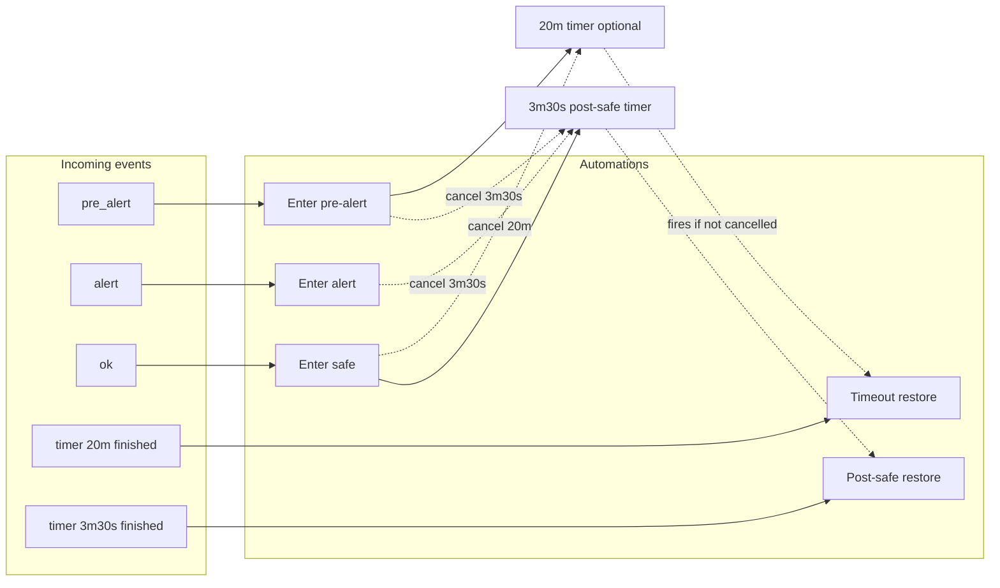
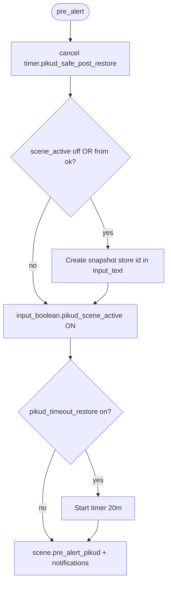
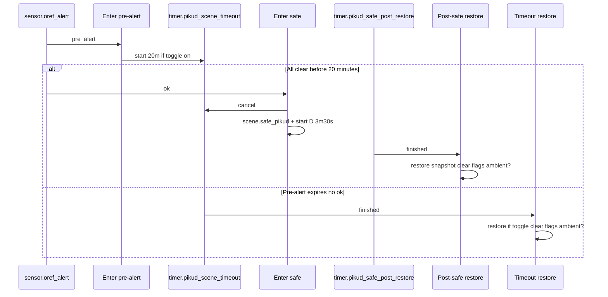
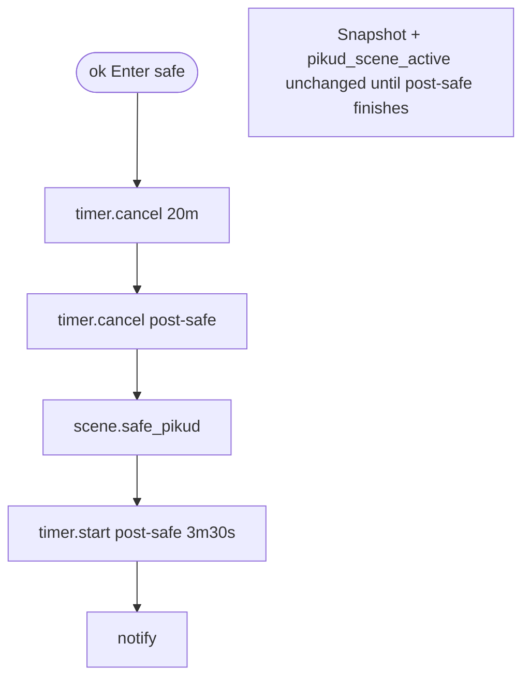
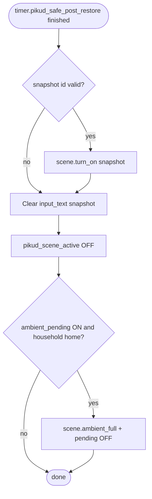

# Pikud Oref automation suite

This suite drives **lighting and notifications** when Israel’s **Pikud Haoref / Oref** civil-defense integration changes state (`sensor.oref_alert`). It snapshots selected lights before applying alert scenes, optionally runs a **20-minute timer** after pre-alert, restores **pre-Pikud** lighting after **all clear** via a **3.5-minute post-safe delay** (or on 20-minute timeout), and coordinates with **evening ambient** lighting so the two do not fight each other.

**Related suite:** evening ambient is documented in [automations-ambient-sunset.md](automations-ambient-sunset.md). Pikud **post-safe**, **timeout**, and related automations apply deferred ambient when `input_boolean.pikud_ambient_pending` is on and `group.household` is **home**.

**Troubleshooting history:** see [HA_DIAGNOSTICS.md](HA_DIAGNOSTICS.md) (section *Pikud Oref lighting*) for older timer/safe interaction notes.

## Oref sensor states (what triggers what)

**`sensor.oref_alert`** moves between integration-defined states. Each value runs a different automation:

```mermaid
stateDiagram-v2
  direction LR
  [*] --> ok : normal
  ok --> pre_alert : warning window
  pre_alert --> alert : escalation
  pre_alert --> ok : stand down
  alert --> ok : all clear
  alert --> pre_alert : rare flap
  note right of pre_alert : Enter pre-alert + optional 20m timer
  note right of alert : Enter alert
  note right of ok : Enter safe: green scene + 3m30s delay then restore
```

---

## Automations (source: `automations.yaml`)

| Automation `id` | Alias | Trigger | Mode |
| ----------------- | ----- | ------- | ---- |
| `pikud_pre_alert_start` | Pikud Oref - Enter pre-alert state | `sensor.oref_alert` → `pre_alert` | restart |
| `pikud_alert_start` | Pikud Oref - Enter alert state | `sensor.oref_alert` → `alert` | restart |
| `pikud_safe_start` | Pikud Oref - Enter safe state | `sensor.oref_alert` → `ok` | restart |
| `pikud_post_safe_restore_original` | Pikud Oref - Post-safe restore original lights | `timer.finished` for `timer.pikud_safe_post_restore` | single |
| `pikud_timeout_restore_original` | Pikud Oref - Restore original lights on timeout | `timer.finished` for `timer.pikud_scene_timeout` | single |

---

## End-to-end behavior (high level)

1. **Pre-alert** — **Cancels** `timer.pikud_safe_post_restore` (so a pending post-safe restore does not run after a new warning). Takes a **new** snapshot if `input_boolean.pikud_scene_active` is **off** **or** Oref came **from** `ok` (re-arm during the post-safe window). Stores `scene.pikud_original_lights` in `input_text.pikud_original_snapshot_scene`, turns **on** `input_boolean.pikud_scene_active`, optionally **starts** `timer.pikud_scene_timeout` for 20 minutes (only when `input_boolean.pikud_timeout_restore` is on), applies `scene.pre_alert_pikud`, and sends notifications.
2. **Alert** — **Cancels** `timer.pikud_safe_post_restore`. If Pikud was not yet active, snapshots as above. Turns on `input_boolean.pikud_scene_active`, applies `scene.alert_pikud`, and sends stronger notifications with shelter timing from `sensor.oref_alert_time_to_shelter` where available.
3. **Safe (`ok`)** — **Cancels** `timer.pikud_scene_timeout` and `timer.pikud_safe_post_restore`, applies **`scene.safe_pikud`** (green), **starts** `timer.pikud_safe_post_restore` for **3 minutes 30 seconds**, and sends safe notifications. It does **not** restore pre-Pikud lights yet: **`input_text`** and **`pikud_scene_active`** stay set until the post-safe timer finishes (so sunset ambient stays deferred during the green “safe” period).
4. **Post-safe (3.5 minutes)** — When `timer.pikud_safe_post_restore` **finishes**, restores the snapshot if valid, clears `input_text`, turns **off** `input_boolean.pikud_scene_active`, and runs the **pending ambient** branch when household is home.
5. **Timeout (20 minutes)** — Fires only if pre-alert started the timer and it is allowed to finish. **Cancels** `timer.pikud_safe_post_restore` (defensive). If `input_boolean.pikud_timeout_restore` is on, it may **restore** the snapshot; it always **clears** the snapshot text and turns off `input_boolean.pikud_scene_active`, then runs the same **pending ambient** branch when household is home.

### Trigger map (automations ↔ events)



### Pre-alert internal flow (snapshot, timer, scene)



### Safe vs timer — two ways to “clean up”

**Early ok:** 20m timer is cancelled; **post-safe** timer runs 3m30s then **post-safe restore** returns pre-Pikud lights.

**No ok for 20m:** timeout automation restores (if toggle on) and clears state; no post-safe timer involved.



### Enter safe — order of operations (lights)



### Post-safe restore — order of operations



---

## Helpers, timers, and text

| Entity | Role |
| ------ | ---- |
| `input_boolean.pikud_scene_active` | **On** while Pikud-controlled scenes should be considered authoritative; blocks duplicate snapshots (except pre-alert **from ok**) and drives the ambient sunset branch (see [ambient doc](automations-ambient-sunset.md)). Stays **on** during the post-safe green period until **post-safe restore** runs. |
| `input_boolean.pikud_timeout_restore` | Defined in [`input_boolean.yaml`](../input_boolean.yaml). When **on**, pre-alert **starts** the 20-minute timer and timeout restore may call `scene.turn_on` on the snapshot. When **off**, the timer is not started and timeout skips scene restore but still clears state. |
| `input_boolean.pikud_ambient_pending` | Set by the sunset automation when ambient should run later but Pikud is active; cleared when post-safe or timeout applies `scene.ambient_full` with household home. |
| `input_text.pikud_original_snapshot_scene` | Stores the entity id of the snapshot scene (typically `scene.pikud_original_lights`) for restore logic. |
| `timer.pikud_scene_timeout` | 20-minute window after pre-alert (optional); **cancelled** on **ok**. May be UI-defined if not in [`timer.yaml`](../timer.yaml). |
| `timer.pikud_safe_post_restore` | **3m30s** delay after **ok**; defined in [`timer.yaml`](../timer.yaml). **Cancelled** on new **pre_alert** or **alert**. |

---

## Scenes and snapshot

| Scene | Typical use in this suite |
| ----- | ------------------------- |
| `scene.pikud_original_lights` | Created at runtime (`scene.create`) from: curtain, peninsula, stove, gateway, cabinet lights (see YAML for exact entity ids). |
| `scene.pre_alert_pikud` | Pre-alert visual state. |
| `scene.alert_pikud` | Full alert visual state. |
| `scene.safe_pikud` | All-clear **green** visual state during the **post-safe delay**; pre-Pikud lighting returns when **post-safe restore** runs. |
| `scene.ambient_full` | Evening ambient; applied from **post-safe** / **timeout** when pending + household home. Defined in [`scenes.yaml`](../scenes.yaml). |

---

## Notifications

- **Primary:** `notify.pikud_oref` (ntfy) for pre-alert, alert, and safe messages.
- **Optional / disabled in repo:** Pushbullet branches exist on the same automations with `enabled: false`.

---

## Design notes (why things are ordered this way)

- **Restart mode** on pre-alert and alert allows rapid re-entry if the sensor flaps; the latest run wins.
- **Safe** cancels the 20m timer so you do not get a **stale** timeout restore after an official **ok**.
- **Post-safe delay** keeps the green **safe** scene visible for **3.5 minutes**, then restores **pre-Pikud** snapshot (no immediate overwrite by green in the same second as restore).
- Pre-alert **from `ok`** refreshes the snapshot even if `pikud_scene_active` is still on, so a **new** warning during the post-safe window does not reuse a stale snapshot.
- **Timeout** cancels the post-safe timer defensively if both could ever overlap.

---

## Files to edit when changing this suite

| File | What to keep in sync |
| ---- | -------------------- |
| [`automations.yaml`](../automations.yaml) | Automation `id`s, conditions, light lists in `scene.create`, notification targets. |
| [`input_boolean.yaml`](../input_boolean.yaml) | `pikud_timeout_restore` (and any future Pikud toggles). |
| [`timer.yaml`](../timer.yaml) | `timer.pikud_safe_post_restore` duration and name. |
| [`scenes.yaml`](../scenes.yaml) | Pikud and ambient scene definitions. |
| [`configuration.yaml`](../configuration.yaml) | `timer: !include timer.yaml` |
| [`templates/oref.yaml`](../templates/oref.yaml) | Template sensors around Oref (informational for dashboards; not the core alert `sensor.oref_alert` from the integration). |
