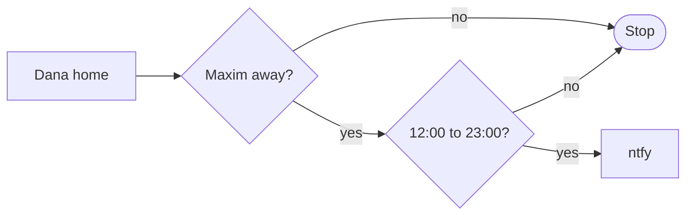
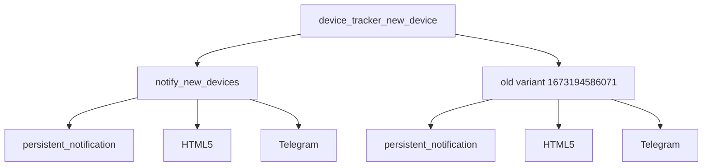

# Presence pings and device discovery

Automations for **household arrival notifications** and **network device_tracker** visibility (unknown MAC at home, newly discovered trackers).

---

## Automations (source: `automations.yaml`)

| Automation `id` | Alias | Role |
| --------------- | ----- | ---- |
| `boos_home_notify_pushbullet` | Boo's home | ntfy when Dana arrives home while Maxim away (time window) |
| `notify_on_unknown_devices_home` | Notify when unknown devices are marked home | Specific tracker → home from not_home |
| `notify_new_devices` | Notify for new devices | `device_tracker_new_device` event → persistent + HTML5 + Telegram |
| `1673194586071` | Notify for new devices (old variant) | Same event, legacy Jinja; **mode single** |

---

## Boo's home

**Trigger:** `person.dana` **not_home** → **home**.

**Conditions:** `person.maxim` **not_home**; time between **12:00** and **23:00**.

**Actions:** Pushbullet action exists but is **disabled**; **ntfy.publish** sends the message with away-since time from `person.dana.last_changed`.

---

## Unknown device at home

**Trigger:** `device_tracker.6c_c7_ec_da_ff_9f` **not_home** → **home**.

**Actions:** Telegram + `persistent_notification` with MAC-friendly name and `source` attribute.

---

## New device tracked

Both automations listen for **`device_tracker_new_device`**.

**Primary** (`notify_new_devices`): persistent notification (full payload), HTML5, Telegram.

**Old variant** (`1673194586071`): similar channels with safer defaults when host name / entity id missing.

If both automations stay enabled, **one** event may produce **duplicate** notifications — consider disabling the legacy automation if the primary covers your needs.

---

## Index

- [Automation suite index](automations-index.md)
