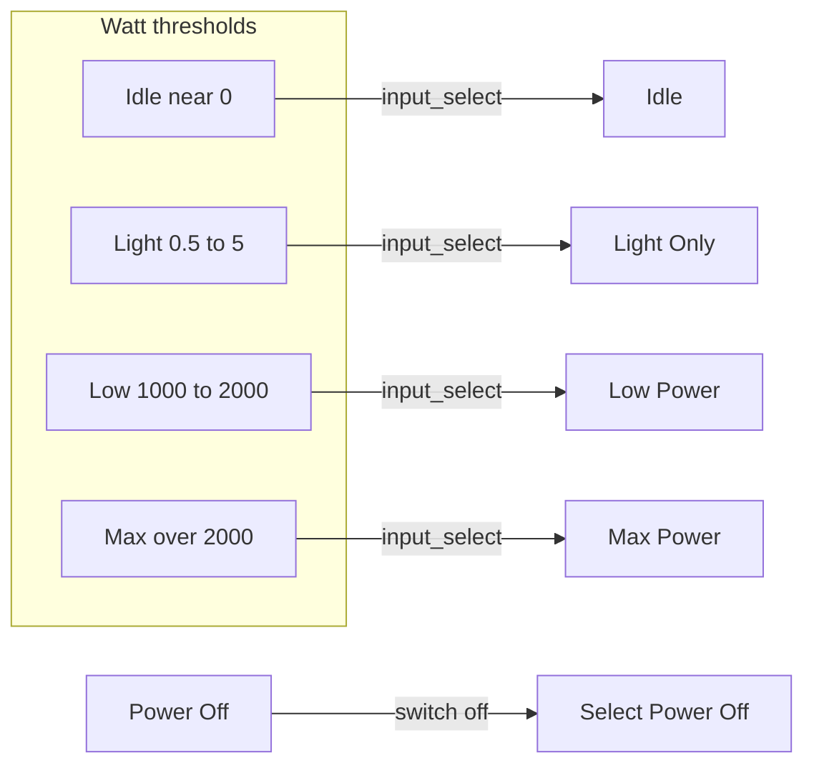

# Shower heater status mirroring

Five automations keep **`input_select.shower_heater_status`** aligned with **`sensor.shower_heater_power`**, **`sensor.shower_heater_status`** (device-reported), and **`switch.shower_heater`**. They only transition when the current select state is in an allowed set (guards against oscillation).

---

## Automations (source: `automations.yaml`)

| Automation `id` | Alias | Trigger | Sets option |
| --------------- | ----- | ------- | ----------- |
| `shower_heater_max_power` | Set shower heater max power state | Power **above** 2000 W | Max Power |
| `shower_heater_low_power` | Set shower heater low power state | Power **1000–2000** W | Low Power |
| `shower_heater_light_only` | Set shower heater light only state | Power **0.5–5** W | Light Only |
| `shower_heater_power_off` | Set shower heater off state | `switch.shower_heater` → **off** | Power Off |
| `shower_heater_idle` | Set shower heater idle state | Power **below** 0.1 W for **1 min**, switch **on** | Idle |

Each of the power-based automations uses **conditions** on `sensor.shower_heater_status` (or equivalent) so only sensible transitions run (see YAML for the full OR lists).

---

## Power bands (conceptual)

```text
  0 W        0.5 W     5 W      1000 W        2000 W
  |------------|--------|-----------|-------------|---->
  Idle band    Light only   Low power    Max power
  (switch on, <0.1 W 1min)
```



**Hard off** bypasses watts: flipping **`switch.shower_heater`** off forces **Power Off** on the select.

---

## Files

| File | Purpose |
| ---- | ------- |
| [`automations.yaml`](../automations.yaml) | All five automations |

---

## Index

- [Automation suite index](automations-index.md)
